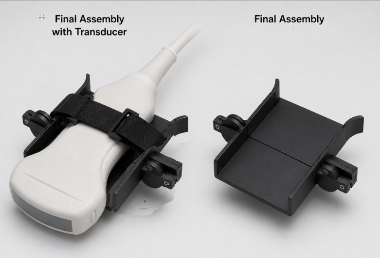
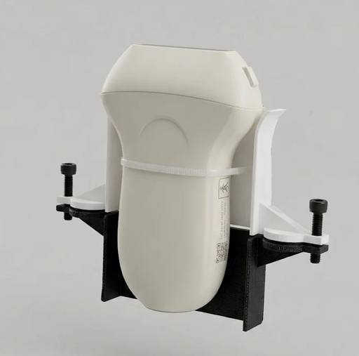

# Ultrasound Probe Orientation Teleoperation




Real-time orientation teleoperation pipeline that lets a Kinova Gen3 7-DOF robotic arm mirror the orientation of a handheld ultrasound probe, using a custom IMU sensing collar. Developed as part of a research internship at IIT Mandi, under Prof. Deepak Raina.

## Overview

The long-term goal of this project is to build an instrumented ultrasound probe collar capable of capturing both **orientation** and **contact force** during handheld probe manipulation, and to use that data to drive a robotic arm in real time — as a step toward supervised robot-learning datasets for autonomous or teleoperated ultrasound scanning.

This repository currently covers the **orientation-tracking half** of that pipeline:

```
Handheld probe + IMU collar  →  ESP32 firmware  →  ROS2 bridge node  →  Cartesian controller  →  Kinova Gen3 (sim)
```

A BNO08x 9-DoF IMU, mounted on a wearable collar around the probe, streams live orientation data over serial to a ROS2 stack, which drives a simulated Kinova Gen3 arm to reproduce that orientation in real time — the arm holds a fixed reference position while only its end-effector orientation tracks the probe.

## Status

**Working (in ROS2/RViz simulation):**
- ESP32/BNO08x firmware streaming live quaternion orientation data
- `cartesian_motion_controller`-based Cartesian orientation control on a simulated Kinova Gen3
- C++ ROS2 bridge node publishing live IMU orientation as real-time targets to the arm
- End-to-end validation: the simulated arm tracks live probe orientation in RViz while holding a fixed reference position

## Hardware

### Sensing collar
- **BNO08x** 9-DoF IMU (I2C) — probe orientation, streamed as a fused Rotation Vector (accelerometer + gyroscope + magnetometer)
- **FSR** (force-sensitive resistor) — auxiliary contact sensing, currently read and transmitted but not yet processed downstream
- Clamshell collar housing with a three-point force puck geometry, designed to mount around a standard ultrasound probe body
- **ESP32** microcontroller — reads the IMU and FSR, streams data over USB serial

### Robotic arm
- **Kinova Gen3**, 7-DOF — currently simulated via `ros2_control`'s `mock_components/GenericSystem`, visualized in RViz. 

## Software architecture

### ESP32 firmware
Reads BNO08x orientation (full Rotation Vector, magnetometer-fused) and FSR force data at ~100 Hz, and streams it as plain CSV text over USB serial:

```
qi,qj,qk,qr,fsr
```

Quaternion field order (`qi, qj, qk, qr`) matches ROS's `geometry_msgs/Quaternion` convention (`x, y, z, w`) directly — no reordering needed on the receiving end.

### ROS2 stack (Jazzy)

| Package | Role |
|---|---|
| `kinova_description` | Kinova Gen3 URDF/xacro, meshes, joint limits |
| `kinova_bringup` | Launch files and `ros2_control` / controller configuration |
| `cartesian_controllers` | FZI's `cartesian_motion_controller` — Cartesian-space IK solver, used as the arm's real-time orientation-tracking controller |
| `imu_bridge` | C++ node reading the ESP32's serial stream and publishing live orientation as `geometry_msgs/msg/PoseStamped` targets |
| `cartesian_target_limiter` | Rate-limits Cartesian targets (SLERP-based angular/linear velocity capping) before forwarding to the controller — built and tested, not currently in the live pipeline |

### Control pipeline

1. **`joint_position_controller`** (`position_controllers/JointGroupPositionController`) drives the arm to a known, non-singular starting pose on launch.
2. Control is handed off to **`cartesian_motion_controller`**, which solves Cartesian-space targets via an internal forward-dynamics IK solver and writes directly to the joint `position` command interfaces.
3. **`imu_bridge`** reads live orientation from the ESP32 over serial and publishes `PoseStamped` messages (fixed reference position, live orientation) directly to the controller's `target_frame` topic.
4. The arm continuously tracks the probe's orientation in real time, visualized in RViz.

Only one of `joint_position_controller` / `cartesian_motion_controller` can be active at a time, since both claim the same joint command interfaces — switching is done via `ros2 control switch_controllers` and initially set in launch.

### Safety / limits
- Per-joint velocity limits enforced via `enforce_command_limits: true` combined with `velocity` limits set in the URDF
- A separate Cartesian-space rate limiter (SLERP-based) exists for capping angular/linear velocity end-to-end, independent of per-joint limits

## Building

```bash
cd ~/kinova_ws
colcon build --cmake-args -DCMAKE_BUILD_TYPE=Release
source install/setup.bash
```

### Dependencies
- ROS2 Jazzy
- `ros2_control`, `ros2_controllers`
- FZI `cartesian_controllers` (`cartesian_controller_base`, `cartesian_motion_controller`) — vendored in this repo
- `libserial-dev` (for `imu_bridge`)

## Running (simulation)

```bash
ros2 launch kinova_bringup rviz_launch.xml
```

This brings up `robot_state_publisher`, `ros2_control_node` (mock hardware), `joint_state_broadcaster`, `joint_position_controller` (active), `cartesian_motion_controller` (loaded, inactive), and RViz.

Switch to Cartesian tracking once the arm is in a safe starting pose (ON BY DEFAULT):

```bash
ros2 control switch_controllers --deactivate joint_position_controller --activate cartesian_motion_controller
```

Run the IMU bridge node (with the ESP32 connected over USB):

```bash
ros2 run imu_bridge orientation_pubsub
```

The arm should now track the probe's live orientation in RViz.

## Acknowledgements

- [FZI `cartesian_controllers`](https://github.com/fzi-forschungszentrum-informatik/cartesian_controllers) — Cartesian-space `ros2_control` controllers
- [SparkFun BNO08x Arduino Library](https://github.com/sparkfun/SparkFun_BNO08x_Arduino_Library)
- Kinova Robotics Gen3 description package
